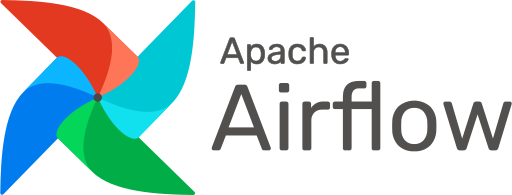
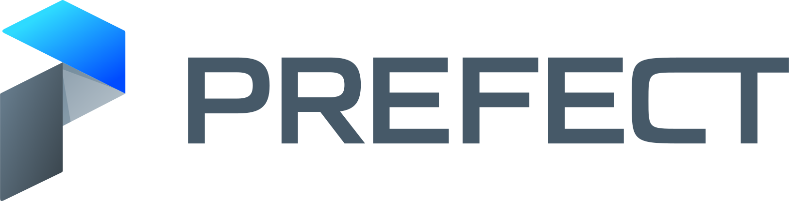

## Hello there 👋, I am Thar Htet San

I am an Artificial Intelligence Engineer with 5+ years of experience. I love creating end-to-end ML solution including Creating Own Algorithm, ML life cycle development, MLOps stacks and  Data Pipelines
. Beyond my professional endeavors, I'm passionate about teaching and sharing knowledge AI/ML System at [DeepFaro](https://www.youtube.com/@deepfaro). 

### Here is my  💻 Main Tech Stack

#### Programming Languages

#### ML FrameWorks

#### MLOps Stack

  

#### Cloud Stack
 

  - 🌱 I’m currently learning AI/RL .
  - 👯 I’m looking to collaborate on Streaming AI Application.
  - 🤔 I’m looking for help with Streaming AI Application.
    

I'm always open to interesting conversations and collaboration :
- email : tharhtetsan.ai@gmail.com , tharhtet1234@gmail.com
- [Linkin](https://www.linkedin.com/in/thar-htet-san-411a77164/) 

