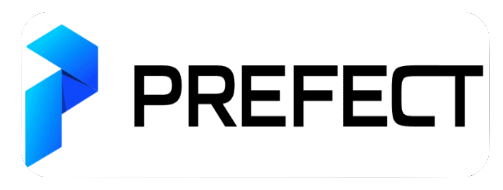
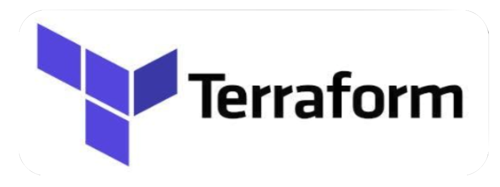

## Hello there 👋, I am Thar Htet San

"I love developing the capability of machines to process information, which will guide your future decisions."

I am an Artificial Intelligence Engineer with 5+ years of experience. I spend most of my time in creating end-to-end ML solution including Creating Own Algorithm, ML life cycle development, MLOps stacks and  Data Pipelines
. Beyond my professional endeavors, I'm passionate about teaching at [DeepFaro](https://www.youtube.com/@deepfaro).

I love sharing knowledge about AI/ML System at [Myanmar Software Engineers](https://www.facebook.com/groups/myanmarsoftwareengineers). So if you have any question about AI/ML system please mentaion me.

I'm currently teaching a course titled ["Machine Learning Systems for Production"](https://github.com/tharhtetsan/ML-in-Prod-batch-1)

### Here is my  💻 Main Tech Stack

#### Programming Languages

#### ML FrameWorks

#### MLOps Stack

 

#### Cloud Stack
 

####  Here is my current work:
  - 🌱 I’m currently learning about Federated learning (FedML) 🤖.
  - 👯 I’m looking to collaborator for Streaming AI Application.
  - 🤔 I’m passionate to discuss about  Reinforcement learning (RL) 🦾 and its capability for our future.
    

I'm always open to interesting conversations and collaboration :

   

- Email : tharhtetsan.ai@gmail.com
        - tharhtet1234@gmail.com

##### Uni Life Coding Achievements
- 2018 [Second winner up in China-Myanmar Innovation Competition](https://drive.google.com/file/d/1dQazVTd_g_FkZJY6rXY4OMUEF9uEoD-t/view?usp=sharing).
- 2018 [First Winner up of Myanmar Collegiate Programming Contest in 2018](https://drive.google.com/file/d/1gnrJvLC64DSFGyneqEMOHuFdWuD-oObf/view?usp=sharing).
- 2016 [Honorable Mention award in 2016 Asia-Yangon Programming Contest](https://drive.google.com/file/d/13R8nm0LGQCKGwDOxbI2BPdzw_mtN_p96/view?usp=sharing).

##### Data Driven Career Achievements
- 2020 [Deep Learning Specialization](https://www.coursera.org/account/accomplishments/specialization/6CV4KC692GLQ).
- 2020 [TensorFlow Developer Specialization](https://www.coursera.org/account/accomplishments/professional-cert/BZZYLKVEYC5P).
- 2020 [AI for Medicine](https://www.coursera.org/account/accomplishments/specialization/VGQW6WH5V2UB).
- 2021 [Generative Adversarial Network (GANs) Specialization](https://www.coursera.org/account/accomplishments/specialization/2NTEBHZKFRSJ).
- 2022 [Machine Learning Engineering for Production (MLOps)](https://coursera.org/share/c02f847463a02fa2794bbe8af646f017)

##### Professional Certifications

